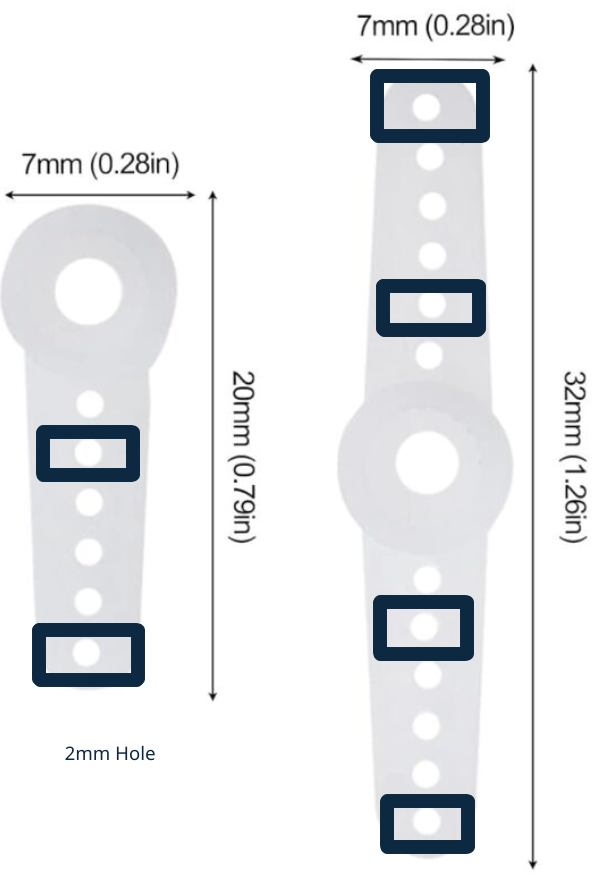

# STEM Club - Nano Robot Arm

## Goal
- A project for school stem clubs that allows students to build and program their own robot arm. 

## Features

- Small, cheap (<£10 unit cost), easy to store, programmable with Python or manual control with joystick
- Easy to fabricate with laser cutter

## Instructions
- 1. Cut the [DXF file](dxf/) using 3mm plywood.
- 2. Assemble and wire using the [Video Instructions](video-instructions/) and [Wiring Instructions](Nano-Robo-Arm-wiring-instructions.pdf)
- 3. Any issues with assembly, [Watch the complete build video](https://drive.google.com/file/d/1T0vYcdThMgW4G9yLXSIMqu09Ss1U54B_/view?usp=drive_link)
- 4. Upload the firmwmare to the arduino: [Arduino file](nano-arm/RoboArm01_v4/) 
> [!NOTE]
> the 'adafruit pwm servo driver library' is required- installation is covered in the full build video )
- 5. Open Python IDLE and use [myapp.py](python/) to program the bot 
> [!NOTE]
The 'COM' number of the connected arduino must match the number set in the python code. The COM number can be found in device manager->COM & LPT Devices->CH40 - see complete build video for further details)

## Resources

- [Bill of Materials](Bill-of-Materials.csv)
- [Video Instructions](video-instructions/) Step by step animated guide for the build
- [Wiring Instructions](Nano-Robo-Arm-wiring-instructions.pdf)
- [Arduino file](RoboArm01_v4/)- upload to the arduino before or after completing the mechanical assembly, this step is best done by a teacher

## Complete Build Video

[Watch the build video](https://drive.google.com/file/d/1T0vYcdThMgW4G9yLXSIMqu09Ss1U54B_/view?usp=drive_link)

## Servo horns
> [!NOTE]
the SG90 servo horns requires the second and last hole to be drilled with a 2mm bit, this step is best done by a teacher.

 

### Python programming
checkout www.sparkpy.net for auto-marked coding tasks using 3D graphics

[![CC BY-NC-SA 4.0][cc-by-nc-sa-shield]][cc-by-nc-sa]

This work is licensed under a
[Creative Commons Attribution-NonCommercial-ShareAlike 4.0 International License][cc-by-nc-sa].

[![CC BY-NC-SA 4.0][cc-by-nc-sa-image]][cc-by-nc-sa]

[cc-by-nc-sa]: http://creativecommons.org/licenses/by-nc-sa/4.0/
[cc-by-nc-sa-image]: https://licensebuttons.net/l/by-nc-sa/4.0/88x31.png
[cc-by-nc-sa-shield]: https://img.shields.io/badge/License-CC%20BY--NC--SA%204.0-lightgrey.svg
